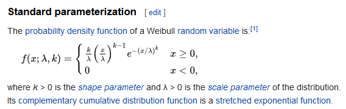

## Correction

There is more than a little inconsistency in how distributions like the exponential and Weibull distributions are presented. I may have made some mistakes in how I presented the results from a Weibull regression model. This presentation is an attempt to fix things up.

```{r load-libraries, echo=FALSE}
options(width=50)
library(knitr)
knitr::opts_chunk$set(echo=FALSE)
library(broom)
library(dplyr, warn.conflicts=FALSE)
library(ggplot2)
library(magrittr)
library(survival)
library(tidyr, warn.conflicts=FALSE, quietly=TRUE)
```

## How I presented the Weibull distribution

The Weibull density and survival function

$f(t,k,\theta) = \frac{k}{\theta}(\frac{t}{\theta})^{k-1}e^{-t^k}$;

$S(t,k,\theta) = e^{-(\frac{t}{\theta})^k}$ 

In most setting, k called the shape parameter and theta is called the scale parameter.

If k > 1, the Weibull distribution has an increasing hazard rate. If k < 1, the Weibull distribution has a decreasing hazard rate.

## Solid line is Weibull with k=2

```{r increasing-hazard, fig.width=4.5, fig.height=2.5}
t <- seq(0, 3, length=1000)
par(mar=c(2.6, 2.6, 0.6, 0.6))
plot(t, 1-pweibull(t, shape=2), type="l", ylim=c(0,1))
lines(t, 1-pweibull(t, shape=1), lty="dotted")
```

## Solid line is Weibull with k=0.5

```{r decreasing-hazard, fig.width=4.5, fig.height=2.5}
par(mar=c(2.6, 2.6, 0.6, 0.6))
plot(t, 1-pweibull(t, shape=0.5), type="l", ylim=c(0,1))
lines(t, 1-pweibull(t, shape=1), lty="dotted")
```

## How Wikipedia presents the Weibull distribution



## The Weibull accelerated time model

Although I did not present the Weibull accelerated time model directly, you can infer that it replaces the parameter $\theta$ with 

$e^{\beta_0+\beta_1X}$

which would give you a survival function of

$S(t,k,\beta_0,\beta_1) = e^{-(\frac{t}{e^{\beta_0+\beta_1X}})^k}$ 


