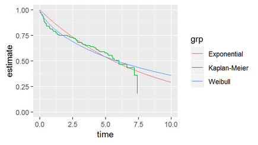
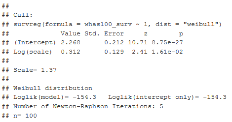
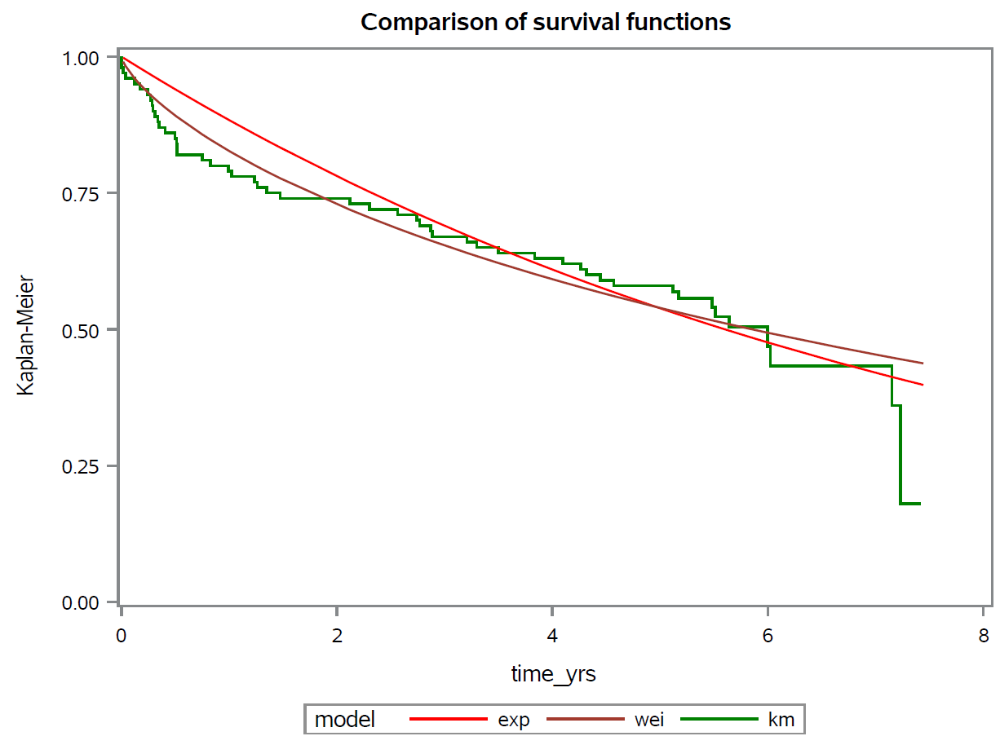
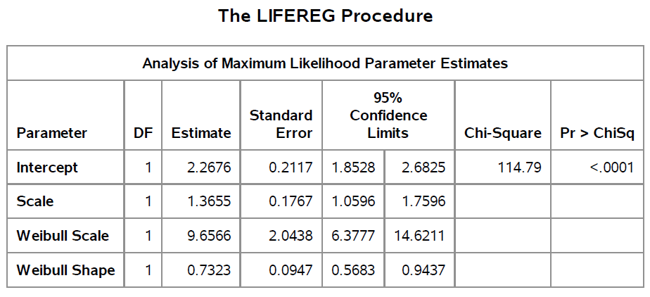
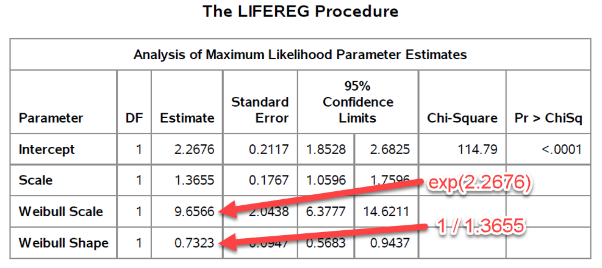

## Correction

There is more than a little inconsistency in how distributions like the exponential and Weibull distributions are presented. I may have made some mistakes in how I presented the results from a Weibull regression model. This presentation is an attempt to fix things up.

```{r load-libraries, echo=FALSE}
options(width=50)
library(knitr)
knitr::opts_chunk$set(echo=FALSE)
library(broom)
library(dplyr, warn.conflicts=FALSE)
library(ggplot2)
library(magrittr)
library(survival)
library(tidyr, warn.conflicts=FALSE, quietly=TRUE)
```

## How I presented the Weibull distribution

The Weibull density and survival function

$f(t,k,\theta) = \frac{k}{\theta}(\frac{t}{\theta})^{k-1}e^{-t^k}$

$S(t,k,\theta) = e^{-(\frac{t}{\theta})^k}$ 

In most settings, k called the shape parameter and $\theta$ is called the scale parameter. In an accelerated time model, the term "scale parameter" is used differently, and I was careless in how I described this change.

## How Wikipedia presents the Weibull distribution


## Relationship between k and hazard for the Weibull distribution

* k > 1, increasing hazard rate. 

* k < 1, decreasing hazard rate.

* k = 1, constant hazard rate (exponential distribution)

## Solid line is Weibull with k=2

```{r increasing-hazard, fig.width=4.5, fig.height=2.5}
t <- seq(0, 3, length=1000)
par(mar=c(2.6, 2.6, 0.6, 0.6))
plot(t, 1-pweibull(t, shape=2), type="l", ylim=c(0,1))
lines(t, 1-pweibull(t, shape=1), lty="dotted")
```

## Solid line is Weibull with k=0.5

```{r decreasing-hazard, fig.width=4.5, fig.height=2.5}
par(mar=c(2.6, 2.6, 0.6, 0.6))
plot(t, 1-pweibull(t, shape=0.5), type="l", ylim=c(0,1))
lines(t, 1-pweibull(t, shape=1), lty="dotted")
```

## The Weibull accelerated time model

Although I did not present the Weibull accelerated time model directly, you can infer that it replaces the parameter $\theta$ with 

$e^{\beta_0+\beta_1X}$

which would give you a survival function of

$S(t,k,\beta_0,\beta_1) = e^{-(\frac{t}{e^{\beta_0+\beta_1X}})^k}$ 

## R graph of Weibull survival



## R table of Weibull fit



## The graph and table don't seem to agree

The graph clearly shows a rapid decline early (relative to an exponential fit) and a slower decline later. This is a decreasing hazard rate, which should be consistent with k < 1.

The table, however, shows a value of "k" much larger than 1.

## SAS graph of Weibull survival



## SAS table of Weibull fit



## SAS is consistent with R

The survival curve in SAS implies the same pattern associated with a decreasing hazard rate.

The table in SAS shows scale of 1.3655, which is the same as R. SAS introduces two new estimates to further confuse things.

## The correct interpretation

The scale parameter in a Weibull accelerated time model is not k, it is $\sigma$=1/k.  

This allows an alternate formulation of the Weibull accelerated time model

$ln(T) = \beta_0+\beta_1 X + \sigma \epsilon$

where $\epsilon$ has a log-Weibull distribution (aka an extreme value distribution, a Gumbel distribution).

## What are those two extra values in the SAS code?



## The two extra SAS parameters

If you use the "traditional" form of the Weibull distribution

$f(t,k,\theta) = \frac{k}{\theta}(\frac{t}{\theta})^{k-1}e^{-t^k}$

$S(t,k,\theta) = e^{-(\frac{t}{\theta})^k}$ 

then SAS is telling you that

$\theta=9.6566$

$k=0.7323$

## Conclusions

There are a lot of different ways to parameterize the Weibull regression model.

My mistake was not to RTFM. See pages 80-81 in Paul Allison's book or section 8.3 of Hosmer, Lemeshow, and May for more details.
